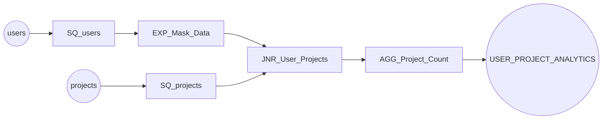

# Cust ETL — Workflow Documentation

# Specification

## Overview
This ETL workflow extracts user and project data, masks sensitive email information, joins the datasets, and aggregates the project count per user to generate analytics for the SpecForge application.

## Sources
The `users` and `projects` PostgreSQL tables serve as data sources containing user account details and project assignments.

## Targets
The `USER_PROJECT_ANALYTICS` PostgreSQL table stores the aggregated user analytics with masked emails and project counts.

## Key Transformations
- `EXP_Mask_Data` applies an expression to mask the email domain with `@***.com`
- `JNR_User_Projects` performs an inner join between users and projects on the `user_id` field
- `AGG_Project_Count` aggregates and counts the projects per user

## Business Rules
- User emails are masked to protect personally identifiable information (PII).
- Each user can have multiple associated projects.

---

# Lineage

| Source Field | Transformation | Target Field | Logic |
|--------------|-----------------|---------------|-------|
| users.id | SQ_users | - | - |
| users.email | EXP_Mask_Data | MASKED_EMAIL | SUBSTR(email, 1, INSTR(email, '@') - 1) || '@***.com' |
| projects.id | SQ_projects | - | - |
| projects.user_id | JNR_User_Projects | user_id | Join condition: user_id = p_user_id |
| - | AGG_Project_Count | TOTAL_PROJECTS | COUNT(project_id) |
| - | AGG_Project_Count | USER_ID | Group by |
| - | AGG_Project_Count | MASKED_EMAIL | Group by |

---

# Project

```
m_SpecForge_Analytics
    SQ_users
    EXP_Mask_Data
    SQ_projects  
    JNR_User_Projects
    AGG_Project_Count
```

---

# Glossary

| Term | Definition | Source Field |
| --- | --- | --- |
| USER_ID | Unique identifier for a user account | users.id |
| MASKED_EMAIL | User's email with domain masked for privacy | users.email (transformed) |
| TOTAL_PROJECTS | Count of projects associated with a user | projects.id (aggregated) |
| user_id | Foreign key linking projects to users | projects.user_id |

---

# Diagram

